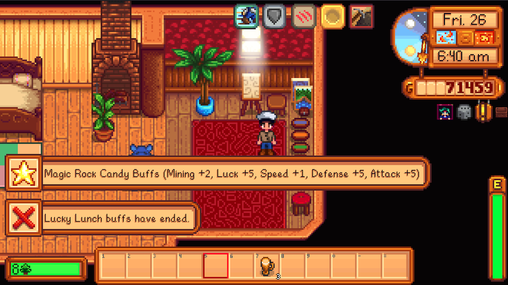
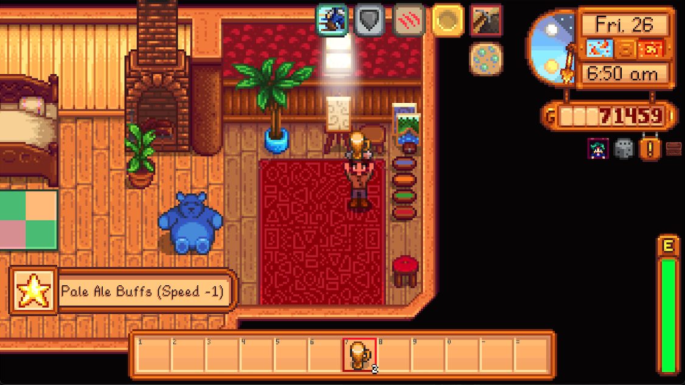
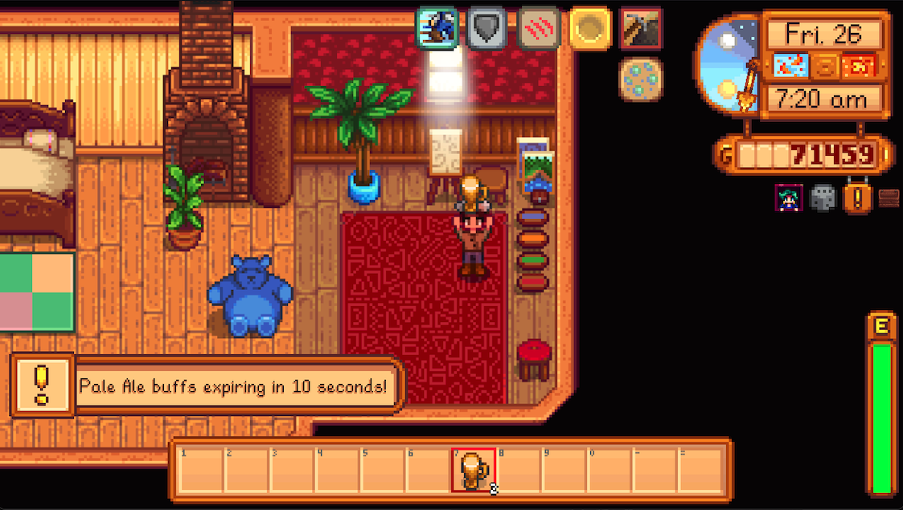
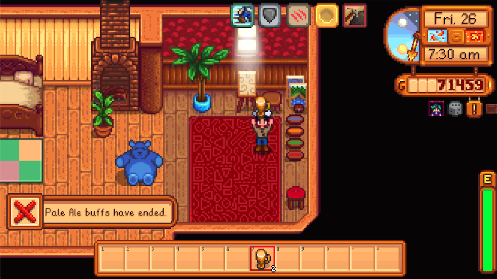

# Buff Notifications

A Stardew Valley mod that displays notifications when buffs start, are about to expire, and end.

## Features

- **Buff Start Notifications**: Receive a notification when a buff is activated
- **Buff Expiring Warnings**: Get a warning when a buff is about to expire (10 seconds before expiration -- configurable)
- **Buff End Notifications**: Be notified when a buff has ended

## Screenshots

### Buff Start Notification

*A notification appears when you consume food or drink that provides a buff*

### Buff Expiring Warning

*A warning appears when your buff is about to expire (Configurable - 10 seconds by default)*

### Buff Ended Warning

*A notification appears when a buff has ended*

## Installation

1. Install [SMAPI](https://smapi.io/)
2. Download the latest version of Buff Notifications from [Nexus Mods](https://www.nexusmods.com/) or the [GitHub releases page](https://github.com/24v/BuffNotifications/releases)
3. Extract the downloaded file to your Stardew Valley Mods folder
4. Run the game using SMAPI

## Configuration

The mod can be configured using the config.json file or through Generic Mod Config Menu if you have it installed.

Options include:
- Enable/disable buff start notifications
- Enable/disable buff expiring warnings
- Enable/disable buff end notifications
- Adjust warning time before buff expiration

## Compatibility

- Stardew Valley 1.6.14 or later
- SMAPI 4.1.7 or later
